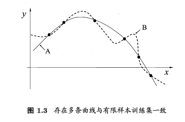

## chapter1 绪论

&emsp;&emsp;“机器学习”（`machine learning`）主要研究是关于在计算机上从数据中产生“模型” (`model`)的算法，即“学习算法”(`learning algorithm`)。

### 1.基本术语

&emsp;&emsp;数据集(`data set`)：记录的集合。

&emsp;&emsp;示例(`instance`) 或样本(`sample`)：关于一个事件或对象的描述。

&emsp;&emsp;属性 (`attribute`) 或特征(`feature`)：反映事件或对象在某方面的表现或性质的事项。

&emsp;&emsp;属性值(`attribute value`)：属性上的取值。

&emsp;&emsp;属性空间(`attribute space`) 、样本空间(`sample space`) 或输入空间：属性张成的空间。

&emsp;&emsp;训练集(`training set`)：训练样本组成的集合。

&emsp;&emsp;训练数据(`training data`)：训练过程中使用的数据。

&emsp;&emsp;训练样本(`training sample`)：训练数据中每个样本。

&emsp;&emsp;分类(`classification`)：欲预测的是离散值。

&emsp;&emsp;回归(`regression`)：欲预测的是连续值。

&emsp;&emsp;对只涉及两个类别的"二分类" (`binary clsification`) 任务，通常称其中一个类为 "正类" (`positive class`)， 另一个类为"反类" (`negative class`)。

&emsp;&emsp;涉及多个类别时，则称为"多分类" (`multi-class classification`)任务。

&emsp;&emsp;测试(`testing`)：学得模型后，使用其进行预测的过程。

&emsp;&emsp;聚类(`clustering`) ：将训练集中的西瓜分成若干 组，每组称为一个"簇" (cluster)。

&emsp;&emsp;泛化(`generalization`) 能力：学得的簇划分能适用于没在训练集中出现的样本，学得模型适用于新样本的能力，

### 2.假设空间

&emsp;&emsp;归纳(`induction`)与演绎(deduction)是科学推理的两大基本手段。

&emsp;&emsp;归纳是从特殊到一般的"泛化" (`generalization`)过程，即从具体的事实归结出一般性规律。

&emsp;&emsp;演绎是从一般到特殊的"特化" (`specialization`)过程，即从基础原理推演出具体状况。

&emsp;&emsp;归纳学习有狭义与广义之分，广义的归纳学习大体相当于从样例中学习， 而狭义的归纳学习则要求从训练数据中学得概念(`concept`) ，因此亦称为"概念学习"或"概念形成"。

&emsp;&emsp;概念学习中最基本的是布尔概念学习，即对"是" "不是"这样的可表示  $0/1$ 布尔值的目标概念的学习。

&emsp;&emsp;版本空间(`version space`)：可能有多个假设与训练集一致，即存在着一个与训练集一致的"假设集合"。

### 3.归纳偏好

&emsp;&emsp;机器学习算法在学习过程中对某种类型假设的偏好，称为"归纳偏好" (`inductive bias`) ,  或简称为"偏好”。

&emsp;&emsp;归纳偏好的作用在图1.3这个回归学习图示中可能更直观。

&emsp;&emsp;奥卡姆剃刀( $Occam's razor$) 是一种常用的、自然科学研究中最基本的原则，即若有多个假设与观察一致，则选最简单的那个。

## 补充：

### 1.监督学习（ $ Supervised Learning$ ）

&emsp;&emsp;监督学习，又叫有监督学习，监督式学习，是机器学习的一种方法，可以由训练资料中学到或建立一个模式（函数 ），并依此模式推测新的实例。训练资料是由输入对象（通常是向量）和预期输出所组成。函数的输出可以是一个连续的值（称为回归分析），或是预测一个分类标签（称作分类）。

&emsp;&emsp;一个监督式学习者的任务在观察完一些事先标记过的训练示例（输入和预期输出）后，去预测这个函数对任何可能出现的输入的输出。要达到此目的，学习者必须以"合理"（见归纳偏向）的方式从现有的资料中一般化到非观察到的情况。在人类和动物感知中，则通常被称为概念学习。

### 2.无监督学习（ $Unsupervised Learning$ ）

&emsp;&emsp;无监督学习，又称非监督式学习，是机器学习的一种方法，没有给定事先标记过的训练示例，自动对输入的资料进行分类或分群。无监督学习的主要运用包含：聚类分析（`cluster analysis`）、关系规则（`association rule`）、维度缩减（`dimensionality reduce`）。它是监督式学习和强化学习等策略之外的一种选择。

&emsp;&emsp;一个常见的无监督学习是数据聚类。在人工神经网络中，生成对抗网络（`GAN`）、自组织映射（`SOM`）和适应性共振理论（`ART`）则是最常用的非监督式学习。

&emsp;&emsp;`ART`模型允许集群的个数可随着问题的大小而变动，并让用户控制成员和同一个集群之间的相似度分数，其方式为透过一个由用户自定而被称为警觉参数的常量。`ART`也用于模式识别，如自动目标识别和数码信号处理。第一个版本为"`ART1`"，是由卡本特和葛罗斯柏格所发展的。

## chapter2 模型评估

### 1.经验误差与过拟合

&emsp;&emsp;把分类错误的样本数占样本总数的比例称为错误率(`errorrate`) ，即如果在m个样本中有 $a$ 个样本分类错误，则错误率 $E= α/m$ ; 相应的 $1-a/m$ 称为精度(`accacy`) ，即精度 $=1 -$ 错误率。

&emsp;&emsp;把学习器的实际预测输出与样本的真实输出之间的差异称为误差(`error`),  学习器在训练集上的误差称为训练误差(`training error`) 或经验误差(`empirical error`) ，在新样本上的误差称为泛化误差(`generalization  error`)。

&emsp;&emsp;过拟合(`overfitting`)：学习器把训练样本学得"太好"了的时候，很可能已经把训练样本自身的一些特点当作了所有潜在样本都会具有的一般性质，这样就会导致泛化性能下降。

&emsp;&emsp;**过拟合**是机器学习面临的关键障碍，各类学习算法都必然带有一些针对过拟合的措施。

### 2.评估方法

#### 1.留出法

&emsp;&emsp;将数据集 $D$ 划分为两个互斥的集合，其中一个集合为训练集 $S$ ，另一个为测试集 $T$ ，在 $S$ 上训练出模型后，用 $T$ 来评估其测试误差，作为对泛化误差的估计。

#### 2.交叉验证法

&emsp;&emsp;先将数据集 $D$ 划分为 $k$ 个大小相似的互斥子集。每一次用 $k-1$ 个子集的并集作为训练集，剩下的一个子集作为测试集；这样就可以获得 $k$ 组训练/测试集，从而可进行 $k$ 次训练和测试，最终返回的是这 $k$ 个测试结果的均值。

#### 3.自助法

&emsp;&emsp;以自主采样法为基础，给定包含m个样本的数据集 $D$ ，对它进行采样产生数据集 $D’$ ：每次随机从 $D$ 中挑选一个样本，将其拷贝放入 $D’$ ，然后将该样本放回数据集 $D$ 中，使该样本在下次采样时仍优可能被；重复 $m$ 次后，得到包含 $m$ 个样本的数据集 $D’$ 。

#### 4.调参与最终模型

- 1.算法的参数，也称为超参数。数目一般在十个以内。通常由人工设定多个参数候选值后产生模型。

- 2.模型的参数。数目一般很多。通常是通过学习来产生多个候选模型。

### 3.性能度量

&emsp;&emsp;性能度量(`performance measure`).：对学习器的泛化性能进行评估，不仅需要有效可行的实验估计方法，还需要有衡量模型泛化能力的评价标准。

#### 1.错误率与精度

&emsp;&emsp;既适用于二分类任务，也适用于多分类任务.错误率是分类错误的样本数占样本总数的比例，精度则是分类正确的样本数占样本总数的比例。

#### 2.查准率、查全率与 $F1$

#### 3. $ROC$ 与 $AUC$

&emsp;&emsp;1. $ROC$

&emsp;&emsp;对于样本数据，我们使用分类器对其进行分类，分类器会给出每个数据为正例的概率，我们可以针对此来设定一个阈值，当某个样本被判断为正例的概率大于这个阈值时，认为该样本为正例，小于则为负例，然后通过计算我们就可以得到一个(`TPR` ,` FPR`)对，即图像上的一个点，我们通过不断调整这个阈值，就得到若干个点，从而画出一条曲线。当这个阈值越大时，越多的样本被分为负例，而这些样本中其实也有正例的存在。这样一来，`TPR`下降（正例数据被分为负例了），`FPR`下降（负类数据更不会被分为正例，但是影响要比`TPR`小，所以斜率呈上升趋势）。阈值越小时，越多的样本被分为正例，而这些样本中可能包含是正例，却被分为负例的样本以及是负例却被分为正例的样本，这样一来`TPR`上升（更多的正例样本被分为正例），`FPR`上升（更多的负例样本被分为正例，影响更大，所以斜率呈下降趋势）。

&emsp;&emsp;2.$AUC$

&emsp;&emsp;`AUC`被定义为`ROC`曲线下的面积，显然这个面积小于 $1$，又因为`ROC`曲线一般都处于 $y=x$这条直线的上方，所以`AUC`一般在 $0.5$ 到 $1$ 之间。

#### 4.代价敏感错误率与代价曲线

### 4.比较检验

- 1.假设检验

- 2.交叉验证 $t$ 检验

- 3.$McNemar$ 检验

- 4.$Friedman$ 检验与 $Nemenyi$ 后续检验

### 5.偏差与方差

&emsp;&emsp;偏差-方差分解(`bias-variance decomposition`) 是解释学习算法泛化性能的一种重要工具。

&emsp;&emsp;泛化误差可分解为偏差、方差与噪声之和。
